# 🧠 Personality AI Chat

A modern Streamlit chatbot where you can choose the AI's personality type to get responses tailored to different cognitive styles and communication patterns.

## ✨ Features

- **Personalized AI Responses** - Get answers tailored to your cognitive preferences
- **Modern UI Design** - Clean, minimalist interface with smooth animations
- **Chat History** - Keep track of your conversations
- **localStorage Integration** - Persistent user data across browser sessions
- **Memory System (Memobase)** - Long-term conversation memory with cloud sync
- **Powered by Mistral-7B** - Using Together.ai's advanced language model

## 📱 localStorage System

The application uses browser localStorage for immediate data persistence:

- **User Name Storage** - Remembers your name across browser sessions
- **Session Management** - Maintains user identity locally  
- **Browser ID Mapping** - Links browser sessions to cloud memory
- **Fast Access** - Instant loading without API calls
- **Privacy First** - Data stays on your device

```javascript
// localStorage functions currently used
saveNameToLocalStorage(name)
getNameFromLocalStorage()
saveBrowserIdToLocalStorage(browserId)
getBrowserIdFromLocalStorage()
saveMemobaseMappingForBrowser(browserId, memobaseId)
getMemobaseMappingForBrowser(browserId)
```

## 🧠 Memory System - Memobase Integration

Advanced cloud-based memory system for long-term conversation storage:

### Key Features:
- **Long-term Memory** - Conversations saved to cloud storage
- **Cross-Device Sync** - Access your history from any device  
- **Context Awareness** - AI remembers previous conversations
- **Manual Save Control** - Choose what to save to preserve API credits
- **Profile Building** - System learns about user preferences over time

### How It Works:
1. **Browser Identity** - Unique ID generated and stored in localStorage
2. **Cloud Mapping** - Browser ID mapped to Memobase user account
3. **Conversation Storage** - Chat history saved as ChatBlob format
4. **Context Retrieval** - Relevant past conversations inform AI responses
5. **Memory Flush** - Triggers profile and event extraction

### Memory Architecture:
```
localStorage (Fast) ←→ Memobase Cloud (Persistent)
      ↓                       ↓
 User Identity          Conversation History
 Session Data           Cross-Device Sync
```

## 🏗️ System Architecture Diagram

Complete data flow architecture of the Personality AI Chat system:


### ⚡ Data Flow Steps:

1. **👤 User Input** - User enters question & selects personality type
2. **📱 Instant Storage** - localStorage saves user identity and session data
3. **☁️ Memory Retrieval** - System fetches relevant conversation history from Memobase
4. **🔧 Prompt Building** - Combines user input + personality + historical context
5. **🤖 AI Processing** - Together.ai processes with Mistral-7B model
6. **✨ Response Generation** - AI generates personality-tailored response
7. **💬 UI Display** - Response appears in chat interface
8. **💾 Save Decision** - User chooses: save to cloud or keep session-only

### 🔄 Simplified Memory Flow:

```mermaid
flowchart LR
    subgraph Browser ["🌐 Browser Environment"]
        LS[📱 localStorage<br/>• User Identity<br/>• Session Data<br/>• Fast Access]
    end
    
    subgraph Cloud ["☁️ Cloud Storage"]
        MB[🧠 Memobase<br/>• Conversation History<br/>• User Profiles<br/>• Cross-Device Sync]
    end
    
    LS -.->|Auto Sync| MB
    MB -.->|Context Retrieval| LS
    
    classDef browserStyle fill:#E3F2FD,stroke:#1976D2,stroke-width:3px
    classDef cloudStyle fill:#E8F5E8,stroke:#388E3C,stroke-width:3px
    
    class LS,Browser browserStyle
    class MB,Cloud cloudStyle
```


## 🛠️ Technologies Used

- **Streamlit** - Web application framework
- **Together.ai API** - AI language model (Mistral-7B)
- **Memobase** - Cloud memory and context management
- **JavaScript localStorage** - Browser-based data persistence
- **Python** - Backend logic
- **CSS** - Custom styling and animations

## 🔧 Installation & Setup

1. **Clone the repository**
   ```bash
   git clone https://github.com/yourusername/cognitype-chatbot.git
   cd cognitype-chatbot
   ```

2. **Install dependencies**
   ```bash
   pip install -r requirements.txt
   ```

3. **Set up environment variables**
   Create a `.env.local` file:
   ```bash
   TOGETHER_API_KEY="your-together-ai-api-key"
   MEMOBASE_API_KEY="your-memobase-api-key"
   MEMOBASE_URL="https://api.memobase.dev"
   ```

4. **Run the application**
   ```bash
   streamlit run app.py
   ```

## 🌐 Deployment

This application can be deployed on various platforms:

- **Streamlit Community Cloud** (Free)
- **Railway** ($5/month, no sleep mode)
- **Render** (Free tier with sleep mode)
- **DigitalOcean App Platform** ($5/month)


## 🤖 AI Integration

The chatbot uses Together.ai's Mistral-7B model with personality-specific prompts:

- **Personalized Responses** - Each personality type gets tailored communication style
- **Context Awareness** - Considers cognitive preferences and decision-making patterns
- **Error Handling** - Robust API error management
- **Rate Limiting** - Handles API limits gracefully

## 🔒 Environment Variables

```bash
TOGETHER_API_KEY=your-together-ai-api-key-here
```

## 📝 License

This project is open source and available under the [MIT License](LICENSE).

## 🤝 Contributing

Contributions are welcome! Please feel free to submit a Pull Request.

## 📧 Contact

For questions or suggestions, please open an issue on GitHub.

---

**Built with ❤️ using Streamlit • Powered by Together.ai & Mistral-7B** 